# DNB Data Science crashcourse

## Option 1 with JupyterHub: If you don't have a google account
1. Go to: https://mybinder.org and fill up the fields with the following values:
- GitHub: https://github.com/aikoyama/DNB_DS_Crashcourse.git
- Git branch, tag, or commit: graduates
- Path to a notebook file (optional): CrashCourse.ipynb (choose URL)
- and press "launch"
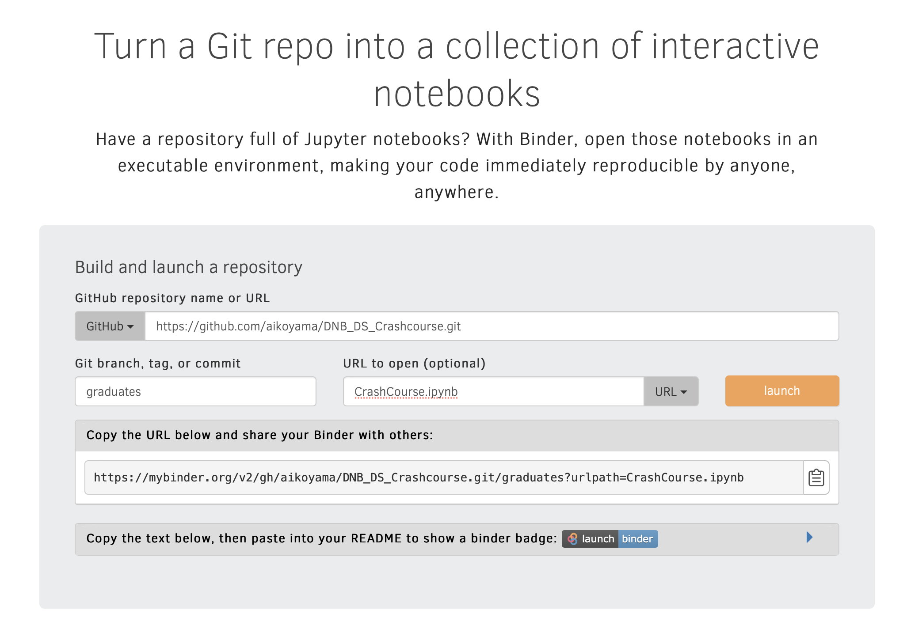

2. Wait until the page loads
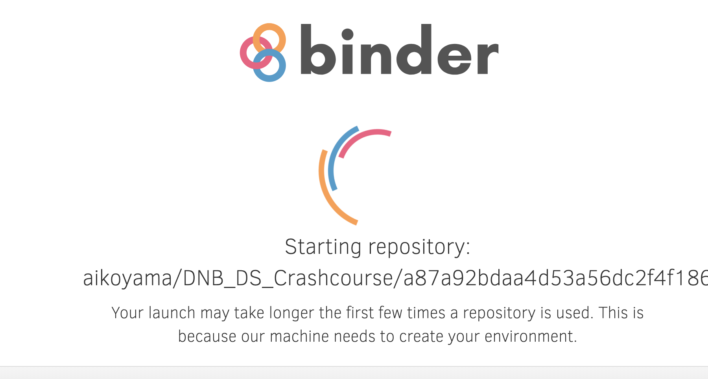

3. When Jupyter notebook is loaded, click on "CrashCourse.ipynb"
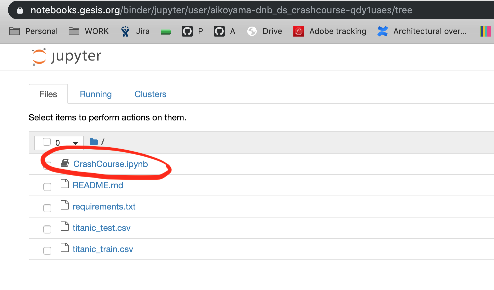

4. Go to "File" -> "Make a Copy"
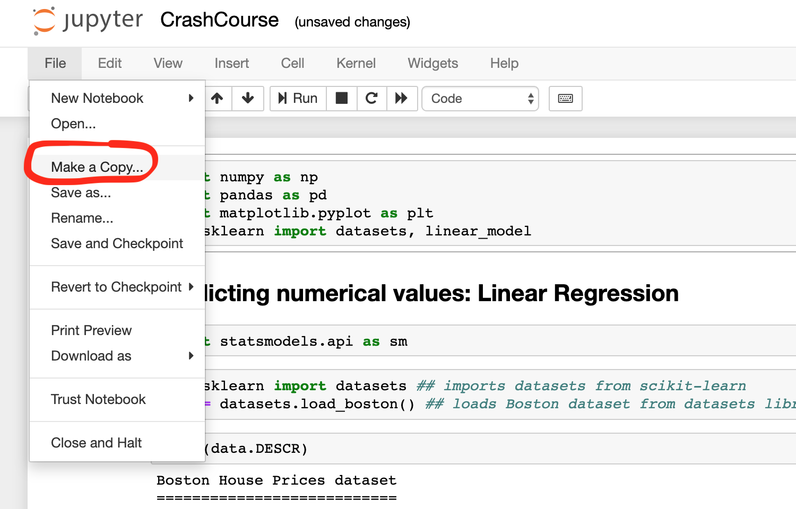

5. Choose a name (e.g.,your name) for the notebook and press "Rename"
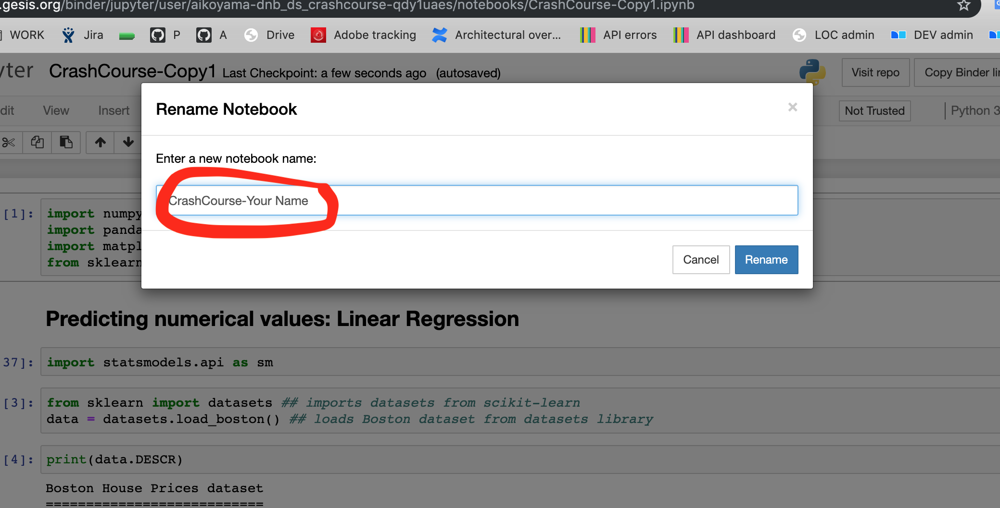

6. Click on the "Run" button to run the code on each cell
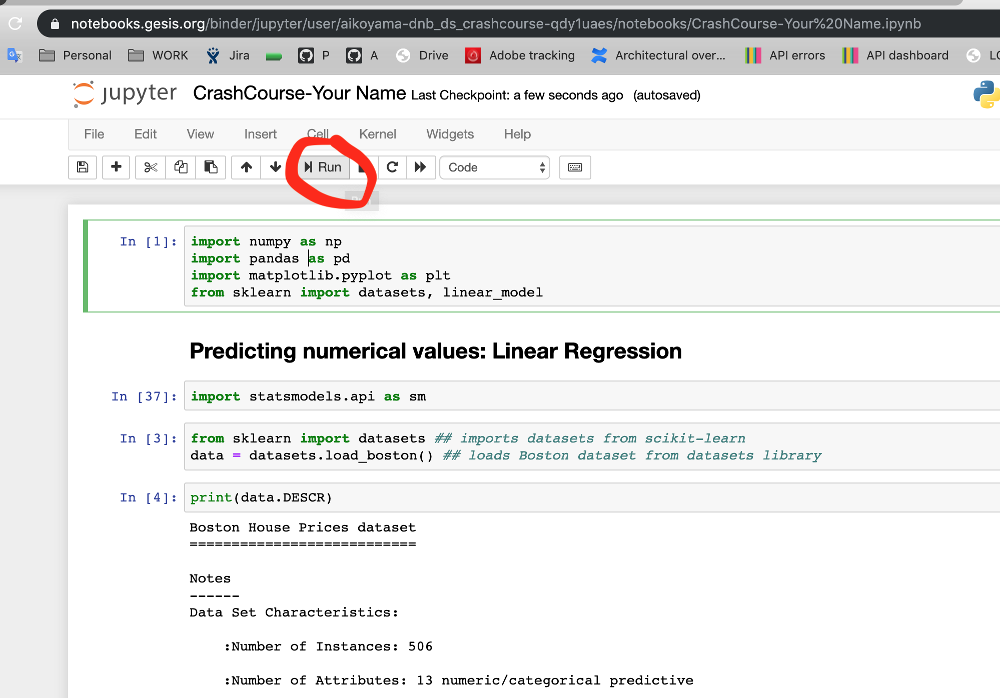

## Option 2 with Google Colaboratory: If you have a google account
1 Click on the link: https://drive.google.com/file/d/1r4gYqhjyW2MjgnKuucMhAN3Iu9XcX5sJ/view?usp=sharing

A) Click on "Open with" and if available, choose: "Google Colaboratory"

B) If the option is not available, then choose: "Connect more apps"

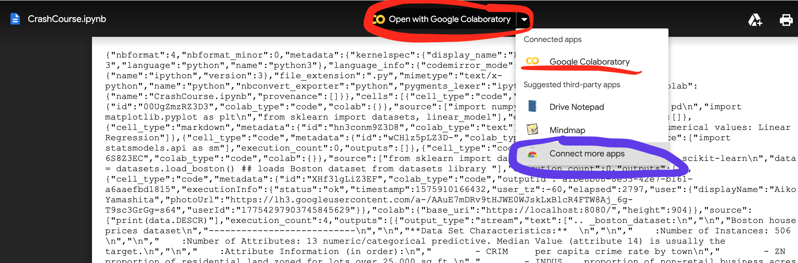

B(1). Enter "colaboratory" and press search, then select "Google Colaboratory"
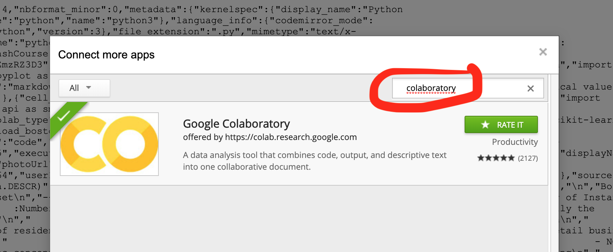

B(2). Click "Connect"
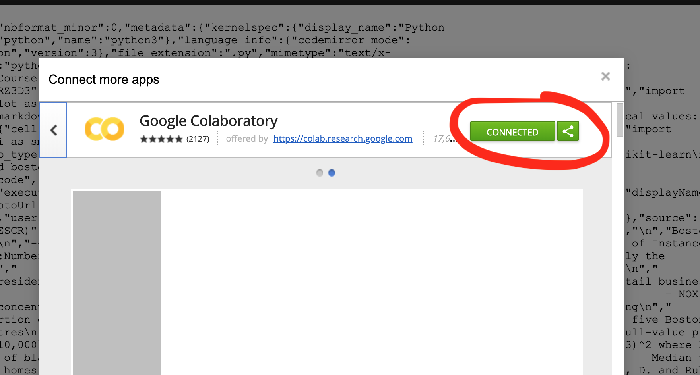

2. Choose "File" -> "Save a copy in Drive"
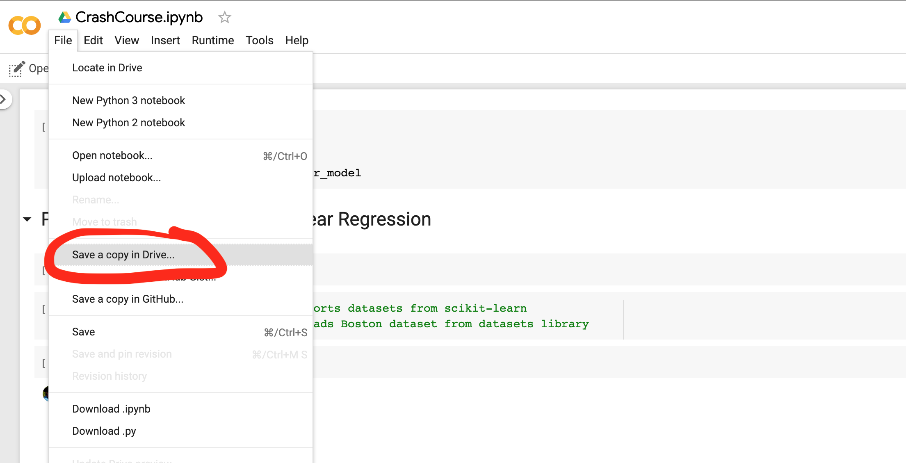

3. Choose a name (e.g.,your name) for the notebook
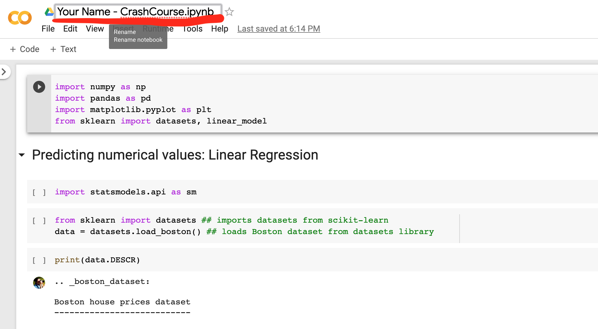

4. Click on the "Play" button to run the code on each cell
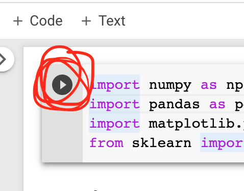
